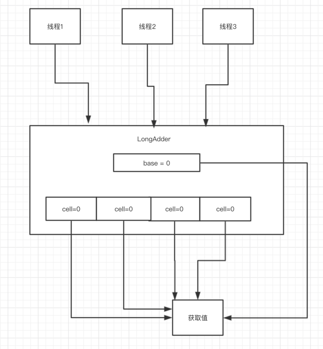

## 上下文切换的挑战

本文内容大多来自《JAVA并发编程的艺术》第一章并发编程的挑战1.1

### 1.上下文的切换的概念
文中提到

- 单核处理器也支持多线程的执行代码，CPU通过给每个线程分配CPU时间片来实现这个机制
- CPU通过时间片分配算法来循环执行任务，当前任务执行完一个时间片之后会切换到下一个任务，但是切换之前会保存这个任务的状态

也就可以这么去理解：

好比自己阅读英语书的时候，旁边有一本字典，如果发现书中由单词不认识的话，那么就需要去查字典才能继续读下去。
查完字典之后，接着去读书，这样切换是会影响效率的，所以同样的上下文的切换是会影响多线程的执行速度。

### 2.多线程是否一定会快？

下面的代码演示的是串行和并发时间的对比

经过本电脑测试

```

// 验证多线程执行的速度
   public class ConcurrencyTest {
   
       // 执行次数
       public static final long count = 100000000;
   
       public static void main(String[] args) throws InterruptedException {
           concurrency();
           serial();
       }
   
       // 单线程速度验证
       private static void concurrency() throws InterruptedException {
           long start = System.currentTimeMillis();
   
           Thread thread = new Thread(() -> {
               int a = 0;
               for (long i = 0; i < count; i++) {
                   a += 5;
               }
           });
           thread.start();
   
           int b = 0;
           for (long i = 0; i < count; i++) {
               b--;
           }
           thread.join();
   
           long time = System.currentTimeMillis() - start;
           System.out.println("concurrency：time = " + time + "ms ；b= " + b);
       }
   
       // 多线程速度验证
       private static void serial() {
           long start = System.currentTimeMillis();
           int a = 0;
           for (int i = 0; i < count; i++) {
               a += 5;
           }
   
           int b = 0;
           for (int i = 0; i < count; i++) {
               b--;
           }
           long time = System.currentTimeMillis() - start;
           System.out.println("serial：time = " + time + "ms ；b= " + b + "； a=" + a);
       }
   
   }

```

本人真实测试结果

- 2.1 count取10000000

```
concurrency：time = 43ms ；b= -10000000
serial：time = 10ms ；b= -10000000； a=50000000
```

- 2.2 count取100000000

```
concurrency：time = 67ms ；b= -100000000
serial：time = 72ms ；b= -100000000； a=500000000
```

- 2.3 count取1000000000
```
concurrency：time = 303ms ；b= -1000000000
serial：time = 705ms ；b= -1000000000； a=705032704
```

从这个结果可以看到当count的数量小于100000000这个数字的时候，串行的效率是明显的高于多线程的效率的，当count的数量大于100000000时候，多线程的优势渐渐的体现

那么为什么并发执行的速度会比穿行慢呢？这是因为线程有创建和上下文切换的开销


### 3.测试上下文切换的时常

一般有两种工具测试上下下文切换的时常
- 使用LMbench3
- 使用vmstat测试

暂时没有测试。

### 4.如何减少上下文的切换

减少上下文的切换的方法有无锁并发编程、CAS算法、使用最少线程和使用协程

- 无锁并发编程。多线程竞争锁的时候，会引起上下文的切换，所以多线程处理数据的时候，可以用一些办法来避免使用锁，比如将数据的ID按照Hash算法取模分段，不同线程处理不同段的数据。
- CAS算法。Java的Atomic包使用CAS算法来更新数据，而不需要加锁
- 使用最少线程。避免创建不需要的线程，比如任务很少，但是创建了很多线程来处理，这样会造成大量线程都处于等待的状态。
- 协程：在单线程里实现多任务程序的调度，并在单线程里维持多个任务间的切换。

引入一个无锁并发编程的案例！ 

**Java8的LongAdder是如何通过分段CAS机制优化多线程自旋问题的**

java8提供了一个对AtomicLong改进后的一个类，LongAdder

大量线程并发更新一个原子类的时候，天然的一个问题就是自旋，会导致并发性能有待提升



分段迁移的思想。某一个线程如果对一个cell更新的时候，发现说出现了很难去更新他的值，出现了多次自旋转的一个问题，如果他CAS失败了，自动迁移段，他会去尝试更新别的Cell的值，这样子的话就可以让一个线程不会盲目的等待一个cell的值了

如果要获取一个值的话，会把base的值和各个cell的值累加到一起。
