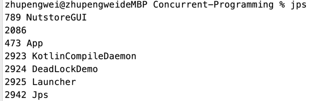
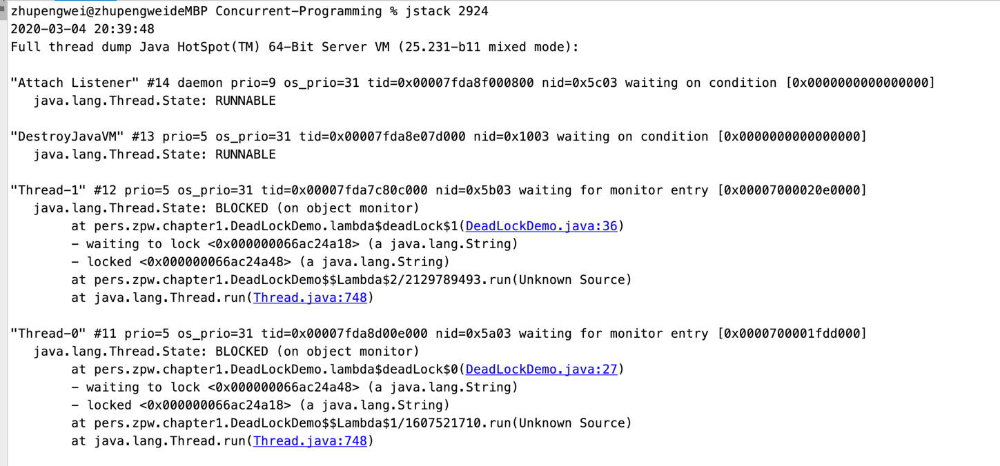

## 死锁
锁呢是一个非常有用的工具，运用的场景十分的多，因为它使用起来非常非常的简单，而且易于理解。但同时他也会带来一些困扰，
那就是可能会引起死锁，一旦引起了死锁，就会造成系统功能不可用。我们可以先来看一段代码，这段代码会引起死锁，使线程t1和
线程t2互相等待对方释放锁

```
// 死锁例子
public class DeadLockDemo {

    public static final String A = "a";
    public static final String B = "b";

    public static void main(String[] args) {

        deadLock();

    }

    private static void deadLock() {

        new Thread(() -> {
            synchronized (A) {
                System.out.println("线程1 获取到A锁");
                try {
                    Thread.sleep(2000);
                } catch (InterruptedException e) {
                    e.printStackTrace();
                }
                synchronized (B) {
                    System.out.println("线程1 获取到B锁");
                }
            }
        }).start();

        new Thread(() -> {
            synchronized (B) {
                System.out.println("线程2 获取到B锁");
                synchronized (A) {
                    System.out.println("线程2 获取到A锁");
                }
            }
        }).start();
    }

}
```

### 定位死锁问题

**1、直接执行jps命令**  
```
jps
```


**2、使用jstack命令**
```
jstack 2924
```



或者可以直接把这个下载了 
```
jstack 2924 > dump.txt
```

上图所示告诉我们是DeadLock这个类的27行和36行引起的死锁


### 避免死锁的几个方法
- 避免一个线程同时获取多个锁
- 避免一个线程在锁内同时占用多个资源，尽量保证每个锁只占用一个资源
- 尝试使用定时锁，比如lock.tryLock(timeout)这种api
- 对于数据库锁，加锁和解锁必须在一个数据库连接池里面，否则会出现解锁失败的情况。