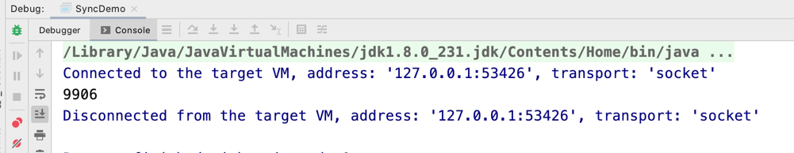
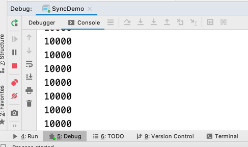

### synchronized

首先来看看用了synchronized和没有用synchronized的区别

```
public class SyncDemo {

    private int count;

    public int getCount() {
        return count;
    }

    private final Object lock;

    public SyncDemo() {
        this.count = 0;
        this.lock = new Object();
    }

    public void add() {
       for (int i = 0; i < 100; i++) {
           count++;
       }
    }
   
    public void syncAdd() {
       synchronized (lock) {
           for (int i = 0; i < 100; i++) {
               count++;
           }
       }
   }
}
```

要进行的操作是对count进行自增的操作，add()以及syncAdd()都是对count这个字段进行自增100的操作

不同的是syncAdd()采用了synchronized这个关键字

然后开启100个线程分别执行这两个函数，期待count的值是10000

```
 public static void main(String[] args) throws InterruptedException {
        while (true) {

            SyncDemo syncDemo = new SyncDemo();
            List<Thread> threadList = new ArrayList<>();

            for (int i = 0; i < 100; i++) {
                threadList.add(new Thread(syncDemo::add, "thread" + i));
            }
            for (Thread thread : threadList) {
                thread.start();
            }
            for (Thread thread : threadList) {
                thread.join();
            }
            System.out.println(syncDemo.getCount());

            if (syncDemo.getCount() != 10000) {
                break;
            }
        }
    }
```
调用add()这个函数的时候,查看运行结果发现不是10000



改掉用 syncAdd(),查看运行结果




那么为什么这里结果不同的呢,原因就是牵涉到另外一个概念,锁,在这个例子中,SYN类中的lock对象就可以看做一把锁

只有拿到锁,才能执行synchronized代码块中的代码块,所以当一个线程在执行synchronized里面的代码并且还没把锁交出来(释放)时,其他线程无法获取

到锁,故无法执行其中的代码,在没有使用synchronized的函数中,因为没有锁机制,有可能for循环还没结束的时候就有新的进程进来,即没有加到100就进来

故count最后不会到10000,而且也不是一个固定的数字
